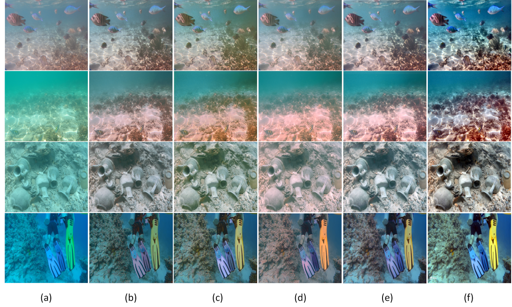
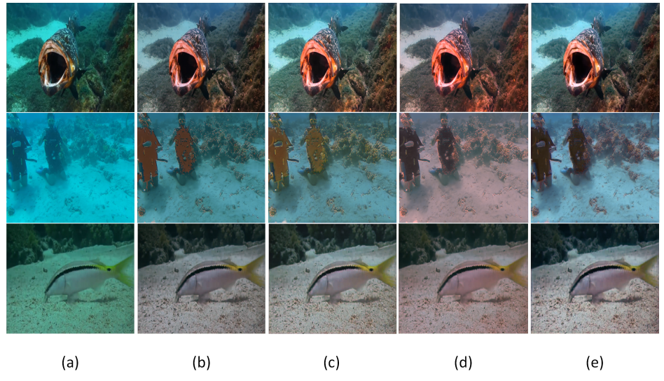

# Improve-Water-Net
针对现有水下图像增强网络架构Water-Net进行改进

# 数据集UIEB获取地址
https://li-chongyi.github.io/proj_benchmark.html

## pipe-line

## RESULT

# Usage
## Testing
1.克隆仓库  
2.从百度云下载checkpoint:https://pan.baidu.com/s/1CLTn-l9iyWkn304mDRFKJQ 提取码: up3x  
3.选择要增强的图片以及加载checkpoint  
4.执行models/test.py  
5.在"results"中查找结果

## Training
1.克隆仓库  
2.通过文件夹中的generate_training_data.py和generate_validation_data.py生成预处理数据  
3.将训练数据放入相应文件夹。目录结构data_UIEB文件夹下应该包含train和val（train文件夹应该包含Ground Truth图像gt_train、直方图均衡化图像input_ce_train、伽马校正图像input_gc_train、白平衡图像input_wb_train和原始图像input_train；val文件夹同理）  
4.执行models/train.py  
5.在checkpoint中找到检查点

